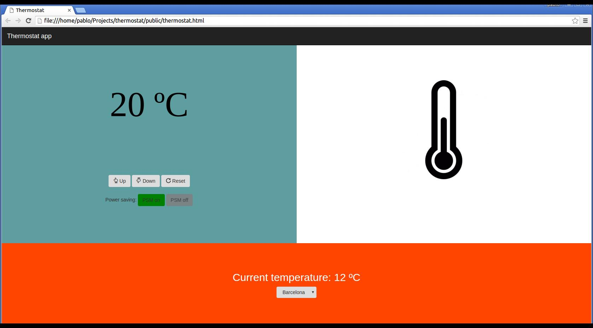

## Thermostat

1. I have developed the logic needed to model a simple thermostat using JavaScript (./public/src/thermostat.js).
2. I used jQuery to add interactive functionality into the App (./public/js/interface.js).
3. I also used a jQuery AJAX call to get the weather information for a specific city and display it to the user.

#### Tests:

I have used Jasmine to Test-Drive Development of a thermostat (./spec/thermostatSpec.js).

#### Specification:

1. Thermostat starts at 20 degrees
2. You can increase the temperature with the up button
3. You can decrease the temperature with the down button
4. The minimum temperature is 10 degrees
5. If power saving mode is on, the maximum temperature is 25 degrees
6. If power saving mode is off, the maximum temperature is 32 degrees
7. Power saving mode is on by default
8. You can reset the temperature to 20 by hitting the reset button
9. The thermostat should colour the display based on energy usage - < 18 is green, < 25 is yellow, otherwise red